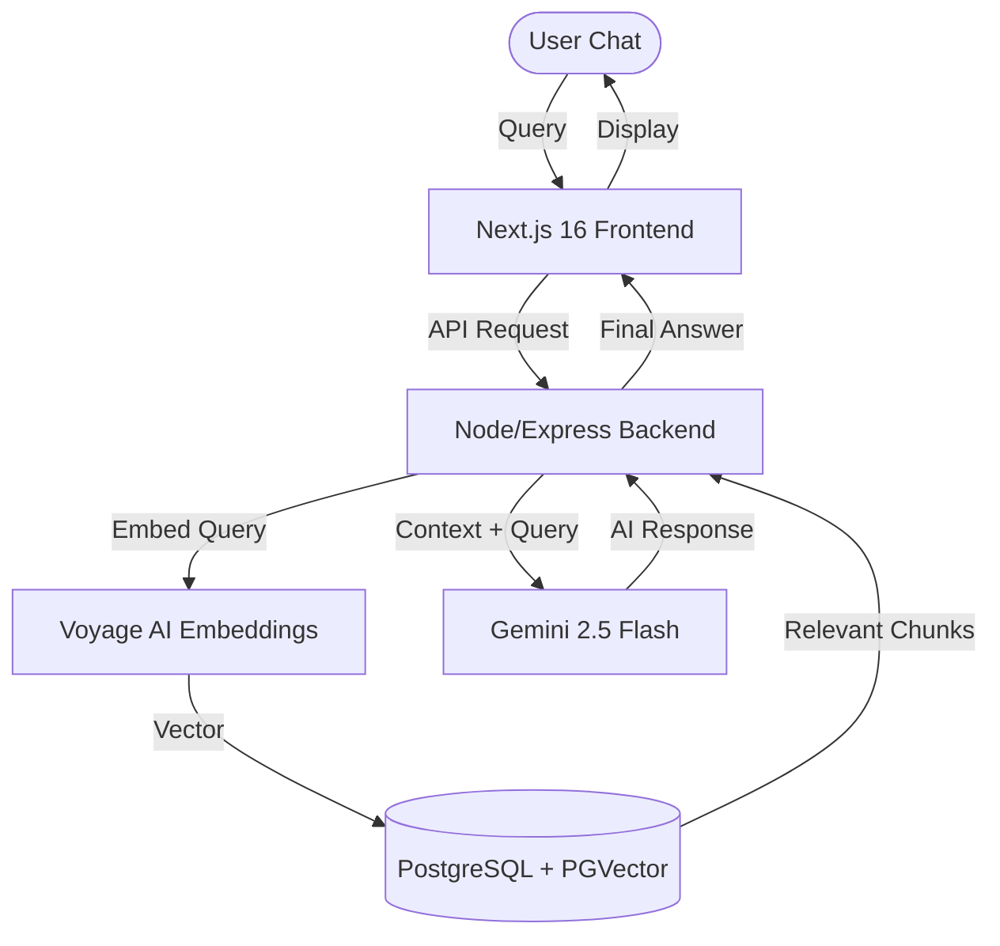

# 🐝 The Hive – Intelligence for Coworking Spaces  
### *A Premium Full-Stack RAG System for Modern Workspace Management*  

---

## 🌟 Project Overview  
**The Hive** is a sophisticated, full-stack application designed to transform how coworking spaces manage and share internal knowledge. Beyond a simple landing page, it features a **Retrieval-Augmented Generation (RAG) Engine** that allows members to interact with a site-specific AI assistant capable of answering complex queries based on uploaded documents (house rules, Wi-Fi configuration, event schedules, and more).  

This project demonstrates proficiency in **AI Orchestration**, **Vector Databases**, and **Modern Full-Stack Engineering**, positioning it as an ideal case study for highly technical roles.

---

## 🚀 Amazing Features  

### 1. 🧠 Production-Grade RAG Engine  
Unlike standard ChatGPT wrappers, The Hive uses a custom-built RAG pipeline:  
- **Context Retrieval**: Uses **Voyage AI (voyage-2)** for state-of-the-art semantic embeddings.  
- **Inference Orchestration**: Powered by **Google Gemini 2.5 Flash** for high-speed, intelligent response generation.  
- **Knowledge Augmentation**: Automatically injects relevant data chunks into the LLM context to minimize hallucination.  

### 2. ⚡ Advanced Vector Similarity Search  
Implemented high-performance document retrieval using **PostgreSQL** with the `<->` (L2 Distance) vector operator via **pgvector**. This allows the system to scan thousands of document chunks in milliseconds and retrieve the most relevant context for any user query.  

### 3. 🛠️ Intelligent Document Processing  
A robust backend pipeline handles the entire knowledge lifecycle:  
- **Multi-Format Parsing**: Extracts text from PDFs and raw text files using `pdf-parse`.  
- **Smart Chunking**: Implements recursive text splitting to maintain semantic coherence across vectorized segments.  
- **Admin Dashboard**: A secure, RBAC-protected interface for administrators to upload, manage, and delete indexed knowledge.  

### 4. 🎨 Premium Branded UI/UX  
The Hive features a bespoke design system built for high-end coworking brands:  
- **Aesthetic**: Deep Forest Green, Muted Gold, and Paper White color palette for a sophisticated "boutique" feel.  
- **Modern Stack**: Built with **Next.js 16**, **React 19**, and **Tailwind CSS 4**.  
- **Micro-Animations**: Smooth transitions, loading shimmers, and interactive widgets provide a "premium app" experience.  

### 5. 🛡️ Secure RBAC Architecture  
The application implements **Role-Based Access Control** (RBAC) using JWT authentication, ensuring that only authorized managers can modify the AI's knowledge base while members enjoy a seamless chat experience.  

---

## 🛠️ Technology Stack  

| Layer | Technology |
| :--- | :--- |
| **Frontend** | Next.js 16 (App Router), React 19, TypeScript, Redux Toolkit, Tailwind CSS 4 |
| **Backend** | Node.js, Express, LangChain (Orchestration) |
| **AI / ML** | Gemini 2.5 Flash (LLM), Voyage-2 (Embeddings) |
| **Database** | PostgreSQL (PGVector), JWT Authentication |
| **Icons & UI** | Lucide-React, React-Icons, Custom CSS Design System |

---

## 🏗️ Technical Architecture  



---

## 📦 Getting Started  

### Prerequisites  
- Node.js (v18+)  
- PostgreSQL (with pgvector extension)  
- API Keys for: Google Gemini & Voyage AI  

### Installation  

1. **Clone the repository**  
   ```bash
   git clone https://github.com/your-username/the-hive.git
   cd the-hive
   ```

2. **Server Setup**  
   ```bash
   cd server
   npm install
   # Create .env file with PORT, DB_URL, GOOGLE_API_KEY, VOYAGE_AI_API_KEY
   npm run dev
   ```

3. **Client Setup**  
   ```bash
   cd ../client
   npm install
   npm run dev
   ```

---

## 👨‍💻 Context  

This project was built to demonstrate:  
- **AI Solution Design**: Ability to architect and deploy custom RAG pipelines.  
- **Data Engineering**: Handling unstructured data (PDFs), vectorization, and similarity-based retrieval.  
- **Modern Web Standards**: Using the latest versions of React and Next.js to build high-performance, accessible UIs.  
- **Scalable Architecture**: Decoupled frontend/backend approach with secure authentication and robust error handling.  

---

## 🗺️ Development Roadmap  

- [ ] **Multi-Vector Retrieval**: Implementing hybrid search (keywords + embeddings) for even better precision.  
- [ ] **Real-time Collaboration**: Integrating websockets for live chat sync across devices.  
- [ ] **Automated PDF Indexing**: A watcher service that automatically indexes files as they are uploaded to the cloud.  
- [ ] **Expanded Multi-Language Support**: Leveraging Gemini's multilingual capabilities for international locations.  


